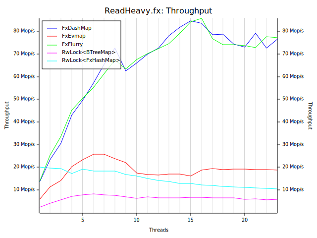
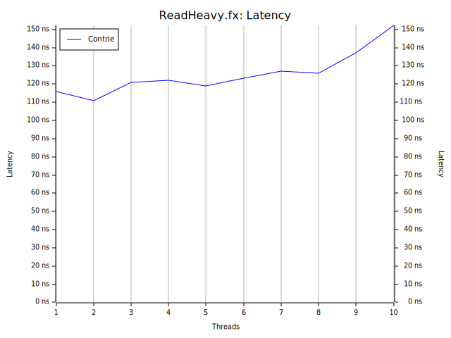
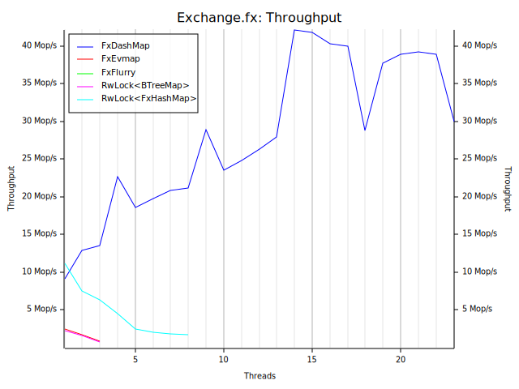
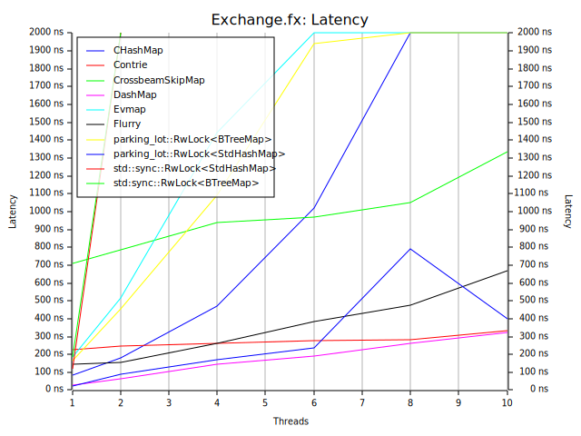
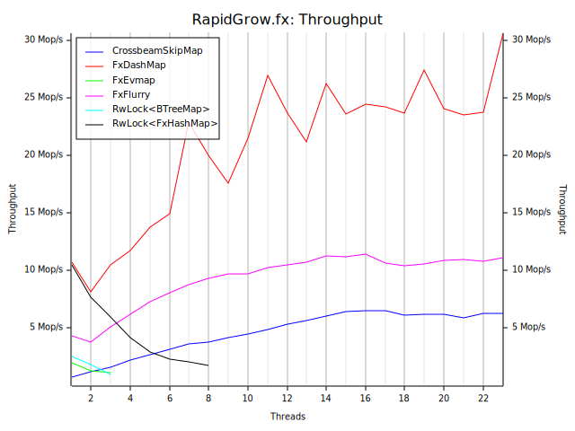
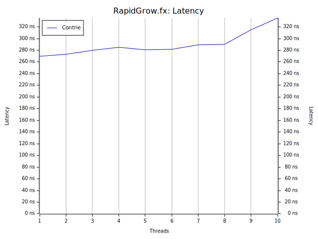

# conc-map-bench

conc-map-bench uses the bustle benchmarking harness. This is a port of the well regarded libcuckoo benchmark.

Implementations benchmarked
- RwLock Std HashMap
- CHashMap
- Contrie
- Flurry
- DashMap
- Evmap
- Crossbeam Skiplist

```sh
> cargo tree | rg 'dashmap|chashmap|contrie|flurry|evmap|crossbeam-skiplist'
```
```
├── chashmap v2.2.2
├── contrie v0.1.4
├── crossbeam-skiplist v0.0.0 (https://github.com/crossbeam-rs/crossbeam#e1d64600)
├── dashmap v4.0.0-rc6
├── evmap v10.0.2
├── flurry v0.3.1
```

## Workloads

### Ready Heavy

A read heavy model with few inserts, removals and updates. Models caching of data in places such as webservers and disk page caches.
```
read   98%
insert  1%
remove  1%
```

### Exchange

Insert and remove heavy model that replicates a scenario where the map is used to exchange data.
```
read    10%
insert  40%
remove  40%
update  10%
```

### Rapid Grow

An insert heavy model that replicates load in a scenario where the map is used to gather large amounts of data under a short burst.
```
read    5%
insert 80%
remove  5%
update 10%
```

## How to run it?

```sh
mv results results.bk
./scripts/bench.bash
./scripts/plot.bash
```

## Results

CPU: AMD Ryzen 7 4800HS, 8 cores, HT enabled.

See the `results/` directory.

### Ready Heavy (fx hasher)
| | |
:-------------------------:|:-------------------------:
 | 

### Exchange (fx hasher)
**NOTE**: the `flurry` case fails because of the OOM killer.

| | |
:-------------------------:|:-------------------------:
 | 

### Rapid Grow (fx hasher)
| | |
:-------------------------:|:-------------------------:
 | 

### Read Heavy (std hasher)
| | |
:-------------------------:|:-------------------------:
 | 

### Exchange (std hasher)
**NOTE**: the `flurry` case fails because of the OOM killer.

| | |
:-------------------------:|:-------------------------:
 | 

### Rapid Grow (std hasher)
| | |
:-------------------------:|:-------------------------:
 | 
